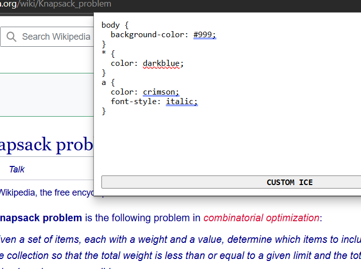

# Custom Ice Extension

*Drip your custom ice-Freeze out boring sites with your own CSS!*

Custom Ice is a simple, privacy-friendly browser extension that empowers users to inject and manage custom CSS on a per-site basis. Designed for creators, developers, and power users, it offers a seamless way to personalize the look and feel of any website—without writing a single line of backend code or relying on third-party servers. Instantly fix up those ugly or broken sites with your own styles, all in a flash, and keep your browsing experience fresh.

## Features

- **Per-Site Custom CSS**: Save and apply unique CSS for each website, stored securely in your browser using IndexedDB.
- **Hide Annoying Components**: Instantly hide popups, ads, or any element you don't want to see on the web—just add a CSS rule and it's gone.
- **Instant Preview**: Changes are injected live—see your custom styles take effect immediately on the current page.
- **Simple UI**: The extension popup features a clean, responsive designs.
- **Easy to Use**: Just open the popup, type or paste your CSS, and hit the button. Your styles are saved and applied instantly.
- **Persistent Storage**: Your CSS is automatically loaded every time you visit a site, with no need to reapply.
- **No Tracking, No Cloud**: All data stays on your device. No analytics, no remote storage, no privacy worries.

## Why Custom Ice?
- **Total Control**: Style the web your way, with no limits.
- **Open Source**: Transparent, hackable, and easy to extend.
- **Performance**: Lightweight, fast, and unobtrusive.

## How It Works

- The extension popup provides a code editor for entering custom CSS.
- CSS is saved per hostname using IndexedDB, ensuring each site gets its own styles.
- On every page load, a content script injects the saved CSS for that site.
- All logic for saving, loading, and injecting CSS is shared between the popup and content scripts via a common utility file (`db-utils.js`).

## Getting Started

1. **Clone or Download the Repo**
   - Click the green "Code" button on this repo and choose "Download ZIP".
   - Extract the ZIP file to a folder on your computer.

2. **Enable Developer Mode on the Browser**
   - For Chrome or Edge: Go to `chrome://extensions/` or `edge://extensions/` respectively.  
   Find the toggle or checkbox for "Developer mode" (usually top right) and turn it on.
   - For Firefox: Go to `about:addons` > click the gear icon > "Install Add-on From File..."

3. **Load the Extension**
   - Click "Load unpacked" or "Load extension".
   - Select the folder where you extracted the extension files.
   - Click the puzzle piece icon in your browser toolbar and pin "Custom Ice" for easy access.

4. **Start Custom Icing!**
   - Visit any website.
   - Click the Custom Ice icon in your toolbar.
   - Add your custom CSS in the popup and hit the button. Your styles will be saved and applied instantly!

**That’s it! You’re now styling the web like a pro.**

## Future Goals

- **Option to Add JavaScript**: Allow users to inject custom JavaScript per site, in addition to CSS.
- **Toggle Custom Ice On/Off**: Provide a simple switch to enable or disable all custom styles/scripts without deleting them.
- **Cross-Browser Operation**: Expand support and ensure seamless operation across all major browsers.

> Made for the web’s true OGs. No cloud, no cap—just pure, local customization.
